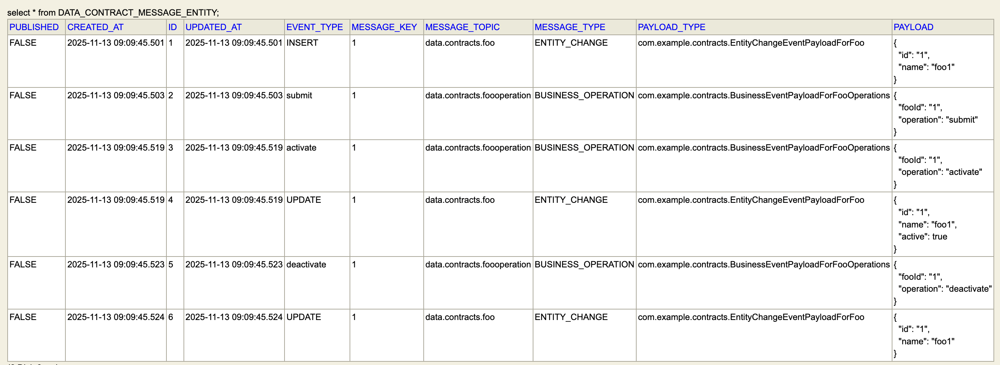

# Data Contracts with JPA and Kafka

A comprehensive demonstration of implementing **Data Contracts** for distributed systems using the **Transactional Outbox Pattern**. This project captures both **Entity Change Events** (CDC) and **Business Operation Events** and reliably publishes them to Apache Kafka using Protocol Buffers.

## 📖 Overview

This project demonstrates how to implement a data contract solution that supports:
- **Entity Change Events**: Automatic capture of INSERT, UPDATE, and DELETE operations on JPA entities
- **Business Operation Events**: Explicit tracking of high-level business operations (e.g., submit, activate, deactivate)
- **Reliable Event Publishing**: Transactional outbox pattern ensures no message loss
- **Schema Evolution**: Protocol Buffers provide backward/forward compatibility

Based on concepts from:
* [An Engineer's Guide to Data Contracts - Part 1](https://dataproducts.substack.com/p/an-engineers-guide-to-data-contracts)
* [An Engineer's Guide to Data Contracts - Part 2](https://dataproducts.substack.com/p/an-engineers-guide-to-data-contracts-6df)

## 🛠️ Technology Stack

- **Language**: Kotlin 1.8.22
- **Framework**: Spring Boot 3.1.3
- **Persistence**: JPA/Hibernate with Spring Data JPA
- **Messaging**: Apache Kafka (via Spring Kafka)
- **Serialization**: Protocol Buffers 3.19.3
- **Build Tool**: Gradle (Kotlin DSL)
- **Testing**: JUnit 5, H2, Embedded Kafka
- **Java Version**: 17

## 🏗️ Architecture

### Key Patterns

#### 1. Transactional Outbox Pattern
Events are first persisted to an outbox table (`DataContractMessageEntity`) within the same database transaction as the business operation. A scheduled publisher then polls unpublished messages and sends them to Kafka, ensuring at-least-once delivery.

#### 2. Change Data Capture via Hibernate Listeners
Entity changes (INSERT/UPDATE/DELETE) are automatically captured using Hibernate event listeners without requiring changes to business logic.

#### 3. Business Event Sourcing via AOP
Business operations are captured using Spring AOP by annotating service methods with `@BusinessOperationSource`.

#### 4. Protocol Buffers Schema
All events conform to a standardized protobuf schema:
```protobuf
message DataContractMessage {
    DataContractMessageMetadata metadata = 1;
    google.protobuf.Any payload = 2;
}
```

## 🔄 How It Works

### Entity Change Events Flow

```
┌─────────────────────┐
│ JPA Entity Changed  │
│ (Insert/Update/Del) │
└──────────┬──────────┘
           │
           ▼
┌─────────────────────┐
│ Hibernate Listener  │
│ Intercepts Event    │
└──────────┬──────────┘
           │
           ▼
┌─────────────────────┐      ┌──────────────────┐
│ Save to Outbox      │◄─────┤ Same Transaction │
│ Table (unpublished) │      └──────────────────┘
└──────────┬──────────┘
           │
           ▼
┌─────────────────────┐
│ Scheduled Publisher │
│ Polls Every 1s      │
└──────────┬──────────┘
           │
           ▼
┌─────────────────────┐
│ Publish to Kafka    │
│ Topic               │
└──────────┬──────────┘
           │
           ▼
┌─────────────────────┐
│ Mark as Published   │
└─────────────────────┘
```

### Business Operation Events Flow

```
┌─────────────────────────┐
│ @BusinessOperationSource│
│ Annotated Method Called │
└───────────┬─────────────┘
            │
            ▼
┌─────────────────────────┐
│ AOP Aspect Intercepts   │
└───────────┬─────────────┘
            │
            ▼
┌─────────────────────────┐
│ Execute Business Logic  │
└───────────┬─────────────┘
            │
            ▼
┌─────────────────────────┐
│ Save Operation Event    │
│ to Outbox Table         │
└───────────┬─────────────┘
            │
            ▼
     (Same as above)
```

## 📁 Project Structure

```
src/main/kotlin/com/example/contracts/
├── DataContractsWithJpaKafkaApplication.kt    # Main application
├── Foo.kt                                      # Sample entity (implements DataContractMessageAware)
├── Bar.kt                                      # Related entity with @ManyToOne relationship
├── FooRepository.kt                            # JPA repository
├── FooService.kt                               # Service with @BusinessOperationSource methods
├── FooOperation.kt                             # Business operation event model
├── DataContractMessageAware.kt                 # Interface for message-producing entities
├── DataContractMessageEntity.kt                # Outbox table entity
├── DataContractMessageEntityRepository.kt      # Outbox repository
├── DataContractMessagePublisher.kt             # Scheduled Kafka publisher
├── DataContractMessageTopicResolver.kt         # Topic naming strategy
├── EntityChangeEventListener.kt                # Hibernate event listener
├── EventListenerRegistryIntegrator.kt          # Registers Hibernate listeners
├── FooServiceDataContractMessageAspect.kt      # AOP aspect for business operations
├── BusinessOperationSource.kt                  # Annotation for business methods
├── MessageSerializer.kt                        # Kafka protobuf serializer
└── DataContractMessageDeserializer.kt          # Kafka protobuf deserializer

src/main/proto/
└── contracts.proto                             # Protocol Buffers schema

src/test/kotlin/com/example/contracts/
└── DataContractsWithJpaKafkaApplicationTests.kt # Comprehensive test suite
```

## 🚀 Getting Started

### Prerequisites
- JDK 17
- Gradle 7.x+

### Build the Project

```bash
./gradlew build
```

This will:
- Compile Kotlin code
- Generate Java classes from protobuf definitions
- Run all tests with embedded Kafka and H2

### Run Tests

```bash
./gradlew test
```

The test suite covers:
- ✅ Entity change events for INSERT operations
- ✅ Entity change events with cascading child entities
- ✅ Entity change events for UPDATE operations
- ✅ Entity change events for DELETE operations
- ✅ Business operation events (submit, activate, deactivate)

### Configuration

**Main Application** (`application.properties`):
```properties
spring.kafka.producer.value-serializer=com.example.contracts.MessageSerializer
```

**Test Configuration** (`application-test.properties`):
```properties
spring.kafka.bootstrap-servers=${spring.embedded.kafka.brokers}
spring.jpa.properties.hibernate.format_sql=true
spring.jpa.properties.hibernate.show_sql=true
spring.datasource.generate-unique-name=true
```

## 💡 Key Concepts

### DataContractMessageAware Interface

Entities that need to publish change events implement this interface:

```kotlin
interface DataContractMessageAware {
    fun getMessagePayload(): Message           // Protobuf payload
    fun getMessagePayloadType(): KClass<out Any>
    fun getMessageKey(): String               // Kafka message key
    fun getMessagePayloadAsJSON(): String     // JSON representation
}
```

### Event Types

The system supports two message types:

1. **ENTITY_CHANGE**: Automatic tracking of data mutations
   - Event types: `INSERT`, `UPDATE`, `DELETE`
   - Captured via Hibernate listeners
   - Examples: `EntityChangeEventPayloadForFoo`, `EntityChangeEventPayloadForBar`

2. **BUSINESS_OPERATION**: Explicit business actions
   - Event types: Custom operation names (e.g., `submit`, `activate`, `deactivate`)
   - Captured via AOP with `@BusinessOperationSource` annotation
   - Example: `BusinessEventPayloadForFooOperations`

### Topic Naming Convention

Topics are automatically resolved based on entity class name:
- `Foo` entity → `data.contracts.foo`
- `Bar` entity → `data.contracts.bar`
- `FooOperation` → `data.contracts.foooperation`

### Outbox Table Schema

```sql
DataContractMessageEntity {
    id: Long                    -- Auto-generated ID
    messageType: String         -- ENTITY_CHANGE or BUSINESS_OPERATION
    eventType: String           -- INSERT/UPDATE/DELETE or operation name
    payloadType: String         -- Fully qualified protobuf class name
    payload: String (LOB)       -- JSON representation of protobuf
    messageTopic: String        -- Target Kafka topic
    messageKey: String          -- Kafka message key (usually entity ID)
    published: Boolean          -- Publishing status
    createdAt: Timestamp        -- Creation time
    updatedAt: Timestamp        -- Last update time
}
```

Here's what the outbox table looks like with actual data:



## 📊 Example Usage

### Define an Entity with Change Tracking

```kotlin
@Entity
data class Foo(
    var name: String,
    var active: Boolean = true
) : DataContractMessageAware {
    @Id
    @GeneratedValue(strategy = GenerationType.AUTO)
    var id: Long? = null

    override fun getMessagePayload(): Message {
        return EntityChangeEventPayloadForFoo
            .newBuilder()
            .setId(id!!)
            .setName(name)
            .setActive(active)
            .build()
    }

    override fun getMessagePayloadType() = EntityChangeEventPayloadForFoo::class
    override fun getMessageKey() = id!!.toString()
}
```

### Define Business Operations

```kotlin
@Service
@Transactional
class FooService(private val fooRepository: FooRepository) {
    
    @BusinessOperationSource("submit")
    fun submit(foo: Foo): Foo = fooRepository.save(foo)
    
    @BusinessOperationSource("activate")
    fun activate(id: Long) {
        fooRepository.findById(id).get().active = true
    }
    
    @BusinessOperationSource("deactivate")
    fun deactivate(id: Long) {
        fooRepository.findById(id).get().active = false
    }
}
```

### Result

When you call `fooRepository.save(foo)`:
1. An `INSERT` entity change event is saved to the outbox
2. The publisher sends it to Kafka topic `data.contracts.foo`

When you call `fooService.submit(foo)`:
1. An `INSERT` entity change event is saved (from repository)
2. A `submit` business operation event is also saved
3. Both are published to their respective topics

## 🔍 Message Format

Published Kafka messages use this structure:

```json
{
  "metadata": {
    "messageType": "ENTITY_CHANGE",
    "eventType": "INSERT",
    "messageId": 123,
    "publishedAt": {
      "seconds": 1699876543,
      "nanos": 123000000
    }
  },
  "payload": {
    "@type": "type.googleapis.com/com.example.contracts.EntityChangeEventPayloadForFoo",
    "id": "1",
    "name": "foo1",
    "active": false
  }
}
```

## ✅ Advantages

- **Reliability**: Transactional outbox ensures no message loss
- **Consistency**: Events and data changes committed atomically
- **Decoupling**: Event capture is transparent to business logic
- **Schema Evolution**: Protobuf supports versioning
- **Testability**: Full test coverage with embedded infrastructure
- **Audit Trail**: Complete history of entity changes and business operations

## 📝 License

This is a demonstration project for educational purposes.

## 🤝 Contributing

This is an example project demonstrating data contract patterns. Feel free to fork and adapt for your use case!
